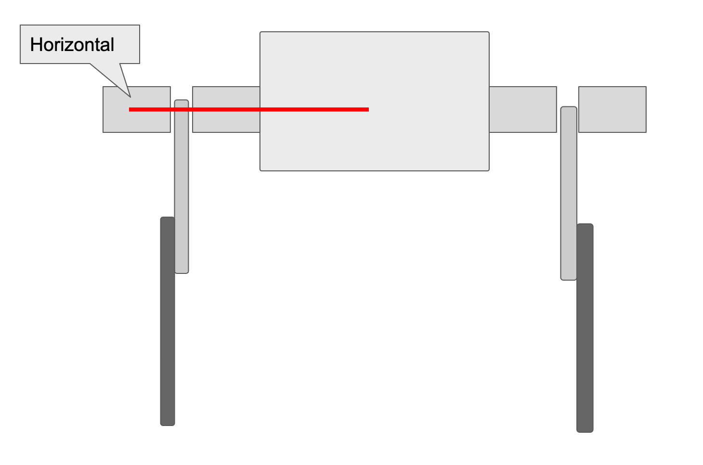
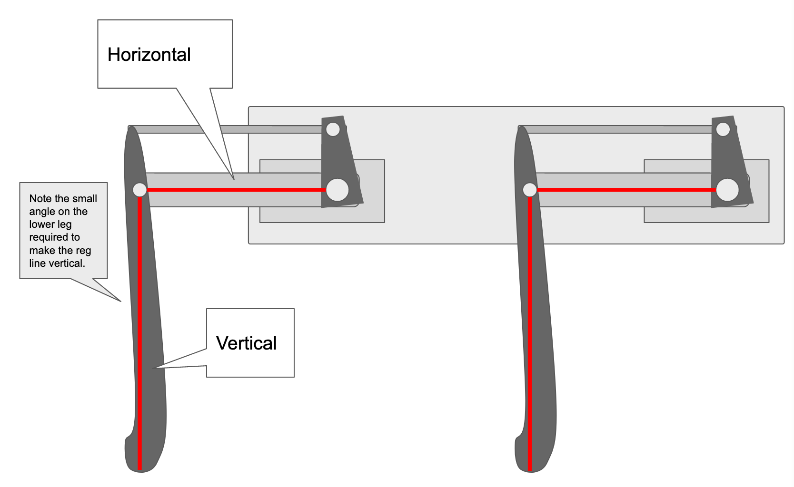

==============
校准
==============

在运行机器狗之前，校准是必不可少的步骤，因为我们尚无法精确测量出伺服臂相对于伺服器轴的固定方式和精度（此步骤关系到机器狗之后是否能平稳运行）。运行校准脚本将提示您进行12个伺服器的每个自由度与已知角度（例如水平或垂直）进行对齐，从而帮助您确定此旋转偏移。

完整的校准视频：

校准1：https://www.bilibili.com/video/BV15i4y1M7YB

校准2：https://www.bilibili.com/video/BV1Ji4y1M7oF

注意：请在电池电量充足时，进行校准，避免出现低电压情况，导致校准中途，断电，造成不必要的损失。

前期准备
-----------
#. 完整的机器狗
#. 某种可以支撑机器狗的支架，这样它的腿可以伸展而不会接触地面/桌子。

步骤
-----------
#. 插入2S 锂电池
#. 如软件安装部分所述通过SSH进入机械狗（北石化的用户请直连显示器，已备好）
#. 停止机器狗的脚本，并接管PWM输出::
    
    rw
    sudo systemctl stop robot
    
#. 运行校准脚本

    * 校准脚本将提示您进行12个伺服电机的校准。当它要求您将链接移动到水平位置时，您可能想知道什么才算使链接水平。答案是:对齐每个链接的关节中心。例如，将上链节水平对齐时，您需要使伺服花键和将上链节与下链节连接的螺栓之间的线尽可能水平。
按照脚本提示输入A或D进行微调，直至水平。可以用眼镜观察，也可使用水平仪。（若还是不明白，建议查看”校准1“的视频连接）
 
    cd StanfordQudruped
    sudo pigpiod
    python3 calibrate_servos.py
    

#. 重新启用机器狗脚本::
    
    sudo systemctl start robot
