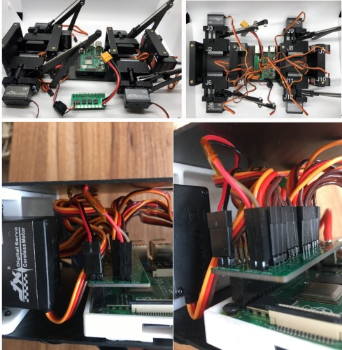

组装
========

.. contents:: :depth: 2

腿部组装
-------------

步骤1.安装伺服码盘 
^^^^^^^^^^^^^^^^^^^^^

*  视频说明：https://www.bilibili.com/video/BV1ny4y1C7i4?p=1
*  材料：M3x6mm内六角螺钉，伺服码盘，胶水（建议新手先不使用），伺服臂（用于调整伺服电机）
*  工具：2.5mm六角螺丝刀

说明：

1.	将伺服臂（不是码盘）扣在伺服上，然后将其转动到中间位置，然后拿走伺服臂。
2.	将伺服码盘对准伺服轴，让码盘的孔位大概在45度位置。（请参见下图）
3.	在螺丝上放一点点胶水。（新手建议先不做）
4.	逐步把M3x6mm螺钉拧紧，让码盘和伺服相互嵌合在一起。
5.	一些码盘的质量较差，拧螺钉时比较费劲。注意来回微调码盘和伺服轴的位置，找到适配的角度就会比较容易。码盘完全安装后，您会再次看到扭矩增加，此时应该停止。码盘完全安装后，请勿过度拧紧螺钉，否则可能会损坏伺服电机。

准备组装

完成效果

步骤2.将M3螺纹插入件安装到内部髋部部件中（已完成此步）
^^^^^^^^^^^^^^^^^^^^^^^^^^^^^^^^^^^^^^^^^^^^^^^^^^^^^^^^^^^^^^^^^

*	没有视频
*	材料：到目前为止组装，M3锥形螺纹嵌件
*	工具：烙铁

说明：

1.	将插入件的锥形面朝下放入孔中
2.	将烙铁设置在500f或260c左右，然后将插件轻轻地压入塑料中。建议仅使用烙铁的重量将插件压入，也建议分步进行，例如，将其压入1mm，取出烙铁，然后再压入另外1mm等。防止烙铁粘在烙铁上。

准备组装

.. image:: ../_static/hip2pre.jpg
    :align: center

完成效果

.. image:: ../_static/hip2com.jpg
    :align: center

步骤3.将伺服器安装到内髋部（内框）中
^^^^^^^^^^^^^^^^^^^^^^^^^^^^^^^^^^^^^

*	视频说明：https://www.bilibili.com/video/BV1ny4y1C7i4?p=2
*	材料：M3x8平头螺钉，内髋部，胶水
*	工具：2mm六角螺丝刀

说明：

1.	以90°角度安装内髋部，然后使用另一侧的孔口拧紧，并将M3x8平头螺钉固定到伺服盘上。（注意左右腿的方向）

准备组装

完成左侧的效果

完成右侧的效果

.. image:: ../_static/hip3completed.jpg
    :align: center

步骤4.安装内髋（内框）关节伺服器
^^^^^^^^^^^^^^^^^^^^^^^^^^^^^^^^^^^^^

*	视频说明：https://www.bilibili.com/video/BV1ny4y1C7i4?p=3
*	材料：迄今为止的内部髋关节组件，伺服电机，M4x10mm塑料螺钉（银色），M3x16mm纽扣头，2x支架
*	工具：T20H梅花螺丝刀，2mm六角螺丝刀

说明：

1.	将伺服电机放入内髋部（内框），然后轻轻摆动，使伺服轴从内髋部的大圆孔中伸出
2.	伺服器左侧用M4x10mm螺钉拧紧，同理右侧用M3x16mm螺钉拧紧。在M3x16mm螺钉上使用胶水。(建议新手不上胶水)
3.	翻转部件并将M3x16mm螺钉拧入连接柱上。

准备组装

	
完成效果 

再看一下组装。请注意，M4螺钉在左侧，M3螺钉在右侧

步骤5.在内部髋关节伺服器上安装伺服臂
^^^^^^^^^^^^^^^^^^^^^^^^^^^^^^^^^^^^^^^^^^^^^^^

*	视频说明：https://www.bilibili.com/video/BV1ny4y1C7i4?p=4
*	材料：迄今为止的内部髋关节组件，M3x8mm钮扣头螺钉，M2x8mm内六角头螺钉，伺服电机
*	工具：2mm六角螺丝刀

说明：

1.	将伺服器转到其中间位置，然后以所示角度（向下45度）滑动伺服臂
2.	将M3x8mm螺钉拧到号角的顶部，然后将M2x8mm螺钉拧入号角的侧面
3.	可以用胶水加固。（新手不建议）

准备组装

完成右侧的步骤

完成左侧的步骤

步骤6.连接腿
^^^^^^^^^^^^^^^^^^^^^

* 	视频说明：https://www.bilibili.com/video/BV1ny4y1C7i4?p=5
*	材质：底脚，顶脚，三部分止推轴承x2，肩螺栓，M3锁紧螺母
*	工具：2毫米螺丝刀，扳手

说明：

1.	在肩螺栓上添加三个垫圈（分体轴承），然后加入下部小腿，然后再添加三个垫圈（分体轴承），然后放入上脚并添加锁紧螺母，拧紧。左右两腿的底部和顶部腿的方向是对应翻转方向。请参阅图片。
为正确的组装作准备（建议先按照下图摆好零件，按照从右向左的顺序组装）

准备组装右腿

准备组装左腿

步骤7.将腿连接至伺服臂 
^^^^^^^^^^^^^^^^^^^^^^^^^^^^^^^^^^^^^^^^^^^^^^^^^

* 	视频说明：https://www.bilibili.com/video/BV1ny4y1C7i4?p=6
*	1.2.1腿部组装-步骤7
*	材料：内髋关节组件（步骤六的组件），支腿组件，M3x6纽扣头x2。
•	工具：2mm六角螺丝刀

说明：

1.	将上肢大腿的弯曲边缘与伺服臂对准。通过碳纤维上预留的孔拧入M3x6螺钉。重复右侧。
2.	特别要检查距离伺服最近的螺钉要垂直拧入，防止和外部伺服臂刮蹭，发生刮蹭的另一个重要原因是支柱拧的太紧，3D打印件硬度有限，不能过度拧紧（SLS 尼龙 PA12 或者 FDM ABS 或者 SLA 树脂都有类似问题）。。

准备组装

完成效果

步骤8.安装外髋部组件
^^^^^^^^^^^^^^^^^^^^^^^^^^^^^^^^^^^

* 	视频说明：https://www.bilibili.com/video/BV1ny4y1C7i4?p=7
*	材料：伺服，外部髋部，M4x10mm螺钉塑料
*	工具：T20H梅花螺丝刀

说明：

1.	将伺服器放入3D打印的框中，并用并用两个M4x10mm螺钉加固定。

准备组装

完成效果

步骤9.在外部伺服器上安装伺服臂
^^^^^^^^^^^^^^^^^^^^^^^^^^^^^^^^^^^^^^^^^^^^

*   视频说明：https://www.bilibili.com/video/BV1ny4y1C7i4?p=8
*	材料：伺服臂，外髋关节组件，M3x8纽扣头，M2x8套筒头
*	工具：2mm六角螺丝刀

说明：

1.	将伺服臂调整到其中间位置，然后如图所示以45度角固定伺服臂。（类似步骤1）
2.	首先用M3x8向下拧紧伺服臂，然后用M2x8螺钉以拧紧伺服臂。（类似步骤5）

准备组装

完成右侧的效果

完成左侧的效果

步骤10.组装两侧
^^^^^^^^^^^^^^^^^^^^^^^^^^^^^^^^^

* 	视频说明：https://www.bilibili.com/video/BV1ny4y1C7i4?p=9
*	材料：内部和外部髋关节组件，用于拧入支架的M3x16纽扣头螺钉，胶水
*	工具：2mm六角螺丝刀

说明：

1.	对齐内部和外部髋关节组件，M4x10mm塑料螺钉应在同一侧，伺服臂应成90度角。
2.	将带有M3x16螺钉的组件通过外部髋关节组件连接到支座。请勿完全拧紧螺钉。可在螺丝上添加胶水。（新手不建议添加胶水）
3.	此时，您的双腿可能会开始移动，可以标记左右两侧，以免感到困惑。如果您不知道哪一方，请与3D模型进行比较：可参考文件“Stanford Pupper Public.stl”（win10自带3D软件可打开）或可访问http://stanford195.autodesk360.com/g/shares/SH919a0QTf3c32634dcfedf61e031f673710

准备组装

完成效果

再仔细看一下组装

步骤11.组装另外两个支架
^^^^^^^^^^^^^^^^^^^^^^^^^^^^^^^^^^^^^^^^

* 	视频说明：https://www.bilibili.com/video/BV1ny4y1C7i4?p=10
*	材料：组件，4颗M3x10圆头螺钉，2个支脚
*	工具：2mm六角螺丝刀

说明：

1.	安装其他2个支脚并用M3x10圆头螺钉拧紧。如图所示：

准备组装

完成效果

步骤12.测试每个伺服器的整个运动范围 
^^^^^^^^^^^^^^^^^^^^^^^^^^^^^^^^^^^^^^^^^^^^^^^^^^^^^^

*	视频说明：https://www.bilibili.com/video/BV1ny4y1C7i4?p=11

说明：

1.	臀部两侧应完全放平（指两个伺服器要放平）
2.	离身体（指机器狗的身体）最近的伺服臂应从45度向上移动到完全触及下部支脚
3.	远离身体的伺服臂应从向上接触支座到向下倾斜45度

步骤13.组装大腿延长杆
^^^^^^^^^^^^^^^^^^^^^^^^^^^^^^^^^^^^^^^^^^^^^^

* 	视频说明：https://www.bilibili.com/video/BV1ny4y1C7i4?p=12
*	材料：螺纹杆，杆端x 2
*	工具：无

说明：

1.	均匀地拧紧杆端，直到杆上最远的孔间距与上腿连杆上的孔（伺服臂中心到最后一个碳钻孔点）相匹配为止 ，请参阅图片。

准备组装

完成效果

步骤14.将大腿延长杆连接到伺服臂
^^^^^^^^^^^^^^^^^^^^^^^^^^^^^^^^^^^^^^^^^^^^^^^^^^^^^^^^

* 	视频说明： https://www.bilibili.com/video/BV1ny4y1C7i4?p=13
*	材料：M3x8纽扣螺丝
*	工具：2mm 螺丝刀（小的内六方扳手） 

说明：

1.	从内侧（注意分清左右腿的内侧），用M3x10螺钉将延长杆固定到伺服臂上。

准备组装

步骤15.将大腿延长杆连接到小腿碳连杆上 
^^^^^^^^^^^^^^^^^^^^^^^^^^^^^^^^^^^^^^^^^^^^^^^^^^^^^^^^^^^^^^^^^^^^^^

* 	视频说明：https://www.bilibili.com/video/BV1ny4y1C7i4?p=14
*	材料：M3x10圆头螺钉，M3锁紧螺母
*	工具：2mm螺丝刀，扳手

说明：

1.	将M3x10螺钉穿过碳纤维件，然后穿过杆端，使用内六方扳手拧紧时，最后使用扳手将M3防松螺母固定到位。

准备组装

完成效果

	
再看一下组装。

恭喜你，完成腿部部件!
^^^^^^

左右两侧效果

继续进行身体组装

身体组装
--------------

步骤1.将锥形螺纹加热插件安装到3D打印的零件中（已完成）
^^^^^^^^^^^^^^^^^^^^^^^^^^^^^^^^^^^^^^^^^^^^^^^^^^^^^^^^^^^^^^^^^^^^

* 	没有视频
*	材料：M3锥形热固镶件，用于塑料x16，4个主体件
*	工具：烙铁设置为约500f / 260c

说明：

1.	每个3D打印的主体都有四个孔-顶部两个，底部两个，用于容纳锥形的热固性塑料插入件
2.	将插入件的锥形面朝下放入孔中
3.	使用大约500f或260c左右的烙铁将插件轻轻地压入塑料中。我建议仅使用熨斗的重量将插件压入，也建议分步进行，例如，将其压入1mm，取出熨斗，然后再压入另外1mm等。防止烙铁粘在烙铁上。

按下锥形螺纹散热片之前

.. image:: ../_static/body1pre.jpg
    :align: center

按下锥形螺纹热插入件后

.. image:: ../_static/body1com.jpg
    :align: center

步骤2.将径向轴承压入主体
^^^^^^^^^^^^^^^^^^^^^^^^^^^^^^^^^^^^^^^^^^^^^^^^^^^^^^^

* 	没有视频
*	材料：4个轴承（3mm x 8mm x 4mm轴承MR693-zz），前前车身部件，后前车身部件
*	工具：手，手摇压力机或虎钳

说明：

1.	将两个轴承压入最前面3D打印支架的两个孔中（称为“前前部”），另外两个轴承压入后面一块的两个孔中（称为“后前部”）。

准备组装

.. image:: ../_static/body2pre.jpg
    :align: center

完成效果

.. image:: ../_static/body2com.jpg
    :align: center

步骤3.固定髋关节组件
^^^^^^^^^^^^^^^^^^^^^^^^^^^^^^^^^^

* 	视频说明： https://www.bilibili.com/video/BV1ny4y1C7i4?p=15
*	材料：16x M4x8螺钉（塑料），4x M3x8纽扣螺钉，四个髋部组件，四个主体部件
*	工具：Torx T20 + 2mm 螺丝刀

说明：

1.	使用M4x8螺钉将两个髋关节组件固定到“后背”车身部件上，并将另外两个髋关节组件固定到“前背”车身部件上
2.	然后，将M3x8钮扣头螺钉穿过所压入的轴承，分别压入前前部和后前部中，然后将它们旋入髋部组件的螺纹嵌件中（如果看不懂描述，建议依据视频进行逐步组装）

准备组装

	
完成效果

再来细看看

步骤4.把组装好的腿和身体支架固定到身体底部碳纤维板上
^^^^^^^^^^^^^^^^^^^^^^^^^^^^^^^^^^^^^^^^^^^^^^^^^^^^^^^^^^^^^^^^^^^^^^^^^^^^

*   视频说明：https://www.bilibili.com/video/BV1ny4y1C7i4?p=16
*	材料：16x M3x6圆头螺钉，2个支腿/主体组件，底部碳纤维板
*	工具：2mm六角螺丝刀

说明：

1.	使用16个M3x6圆头螺钉将您构建的两个支腿/车身组件固定到底部碳纤维板上。

准备组装

	
完成效果

步骤5.准备并安装Raspberry Pi盒子
^^^^^^^^^^^^^^^^^^^^^^^^^^^^^^^^^^^^^^^^^^^^^^^^

* 	视频说明：https://www.bilibili.com/video/BV1ny4y1C7i4?p=17
*	材质：Raspberry Pi外壳（picase.stl），4个M2.5锥形热固性插入件，4个M2.5x6内六角螺钉，双锁
*	工具：2mm 螺丝刀，烙铁（已完成）

说明：

1.	用以安装之前插入件相同的方式，将M2.5插入件压入树莓派外壳的孔中。然后，使用M2.5x6内六角螺钉将树莓派拧到外壳上。（这里可以直接拧紧螺丝固定，烙铁部分已完成）
2.	最后，用固定绑带把树莓派固定到底部碳纤维板上。

准备组装

完成效果

步骤6.组装PCB（北石化的用户请跳过此步）
^^^^^^^^^^^^^^^^^^^^^^^^^^^^^^^^^^^^^^^^^^^^^^^^^^

请阅览 PCB组装

步骤7.将伺服电机插入Raspberry Pi
^^^^^^^^^^^^^^^^^^^^^^^^^^^^^^^^^^^^^^^^^^^^^

* 	视频说明：https://www.bilibili.com/video/BV1ny4y1C7i4?p=18
*	材料：安装在底板上的四个髋部组件，安装有伺服功率分配的Raspberry Pi（插入相应的引脚）
*	工具：无

说明：

1.	将PCB连接到Rasberry Pi
2.	如下图所示，将伺服电缆插入定制电路板。
3.	J1至J12对应于焊接到电路板上的十二组插头之一。电路板上有指示器，用于指示如何将来自伺服电动机的信号线，地线和正极线对准电路板。 （注意插针方向，伺服的J1J2…J12和电源板上的J1J2…J12一一对应）
4.	按照示意图把伺服带的杜邦线分别插入电源板的对应位置，注意线序。
5.	把变压器连接电源板
6.	注意UBEC变压器，确保使其正确连接（此步最好在PCB组装时做好）

注意看以下两幅图:

UBEC的连接方式，注意看截图
尤其要注意正负极，
它的作用是把电池的7.4V转5V给到树莓派供电

准备组装

	
完成效果

恭喜你，完成身体部件!
^^^^^^

如果尚未完成PCB组装，请完成。
	
PCB组装(北石化请跳过此步) 
--------------

步骤1.将伺服连接器接头焊接到板上
^^^^^^^^^^^^^^^^^^^^^^^^^^^^^^^^^^^^^^^^^^^^^^^^^^^^^^^^^

* 	没有视频
*	材料：PCB，12个公头，每个头3个针
*	工具：烙铁，最好是热输出> = 60W的烙铁。

说明：

1.	如图所示，将12个公头连接器引脚中的每一个都插入各自的插槽中。
2.	然后，将电路板上下颠倒，以便可以焊接下侧。当您将电路板翻转过来时，请注意不要使插头全部掉落。完成此操作后，将硬泡沫块顶在针的顶部，以确保当电路板翻转时它们不会倾斜或掉落。翻转电路板后，您还需要检查引脚是否大部分垂直于电路板。
3.	电路板翻转后，焊接所有信号引脚，以将插头固定在适当的位置。信号引脚是最靠近Raspberry Pi接头连接器引脚孔（2x20阵列）的引脚。
4.	将插头全部固定到位后，焊接其余的接地引脚和正极引脚。

将所有针脚未焊接到电路板上

.. image:: ../_static/pcb1pre.jpg
    :align: center
	
完成步骤，焊接销

.. image:: ../_static/pcb1pre.jpg
    :align: center
	
步骤2.焊接Raspberry Pi接引脚
^^^^^^^^^^^^^^^^^^^^^^^^^^^^^^^^^^^^^^^^^^^^^

*   没有视频
*	材料：PCB，2x20引脚排针
*	工具：烙铁

说明：

1.	将2x20排针插入PCB。确保从底部插入插头，以使插针从顶部伸出。这将使页眉位于Raspberry Pi的顶部。
2.	将PCB和排针固定在虎钳中
3.	从顶部焊接排针。

将2x20排针焊接到PCB上之后。

.. image:: ../_static/pcb2.jpg
    :align: center

焊接2x20排针后，板的下面的效果。

.. image:: ../_static/pcb2an.jpg
    :align: center

步骤3.将bec和5V焊接在引脚上
^^^^^^^^^^^^^^^^^^^^^^^^^^^^^^^^^^^^^^^

* 	没有视频
*	材料：PCB，排针
*	工具：烙铁，副

说明：

1.	折断一对1x2排针，并将其焊接到标有Vbat和Regulated 5V的区域。重要提示：如果手头没有杜邦/ JST压接和压接器，则请勿将引脚焊接到Vbat孔。

BEC和5V引脚（右侧的四个引脚）焊接到PCB。

.. image:: ../_static/pcb3.jpg
    :align: center

Step 4: Solder the XT 60 pigtail connector to the PCB
^^^^^^^^^^^^^^^^^^^^^^^^^^^^^^^^^^^^^^^^^^^^^^^^^^^^^^^^^

* 	没有视频*
*	材质：PCB，XT60连接器
*	工具：烙铁，老虎钳

说明：

1.	从顶部插入xt 60连接器，从底部插入焊料。确保极性正确！PCB上xt 60连接器的+和-线几乎没有标签。

XT60公尾纤（母外壳，公针）

.. image:: ../_static/pcb4pre.jpg
    :align: center

焊接在XT60连接器上之后的效果

.. image:: ../_static/pcb4com.jpg
    :align: center

XT60焊接连接的另一视角

.. image:: ../_static/pcb4coman.jpg
    :align: center
	
步骤5.测试配电板是否短路
^^^^^^^^^^^^^^^^^^^^^^^^^^^^^^^^^^^^^^^^^^^^^^^^^^^^^

* 	没有视频
*	材质：PCB
*	工具：万用表

说明：

1.	目视检查电路板，以确保没有焊料斑点短路
2.	将万用表转到短路检测设置。这通常由一个小的扬声器图标指示。
3.	测试xt 60连接器的+和-引脚是否有短路情况
4.	测试信号线是否都没有短路至+或-。
5.	测试信号线之间是否没有短路。

步骤6.测试伺服电源
^^^^^^^^^^^^^^^^^^^^^^^^^^^^^^

* 	没有视频
*	材料：PCB，伺服
*	工具：无

说明：

1.	插入您的2S脂质体（切勿插入超过8.4V的电压，否则很可能会烧坏您的伺服器）
2.	将单个伺服器连接到板上，注意信号线，-和+的标签。在伺服系统上，信号线通常为黄色或白色。
3.	参考图片确定正确的导线方向。
4.	如果插入电源后伺服器仍未开始冒烟，那就好！
5.	暂时拔下伺服器和电池。

.. image:: ../_static/pcb6.jpg
    :align: center

步骤7.插入5V稳压器
^^^^^^^^^^^^^^^^^^^^^^^^^^^^^^^^^^^^^^^^^^^^

* •	没有视频
•	材料：PCB，5V稳压器（BEC）
•	工具：烙铁或卷压钳
说明：
1.	对于树莓派，我们使用5V UBEC将电池的7.4-8.4V电压降低至5V。UBEC的5V输出具有一个JST连接器，该连接器与您在步骤4中焊接的引脚的Regulated 5V良好匹配。
2.	BEC的输入侧有一个公JST连接器，您现在应该将其切断。
3.	您可以剥开这些输入电线并将其直接焊接到Vbat孔，或者可以将杜邦母头压接在电线上，将它们放在1x2的外壳中，然后将电线插入Vbat引脚。

如图所示：

.. image:: ../_static/pcb7ubec.jpg
    :align: center

UBEC的连接方式，注意看上面的截图，
尤其要注意正负极，
它的作用是把电池的7.4V转5V给到树莓派供电

恭喜你，完成PCB组件!
^^^^^^

如果尚未完成髋关节组装和车身组装，请完成。

