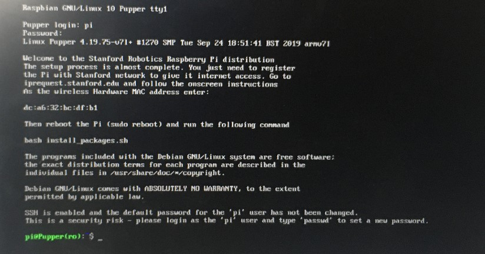
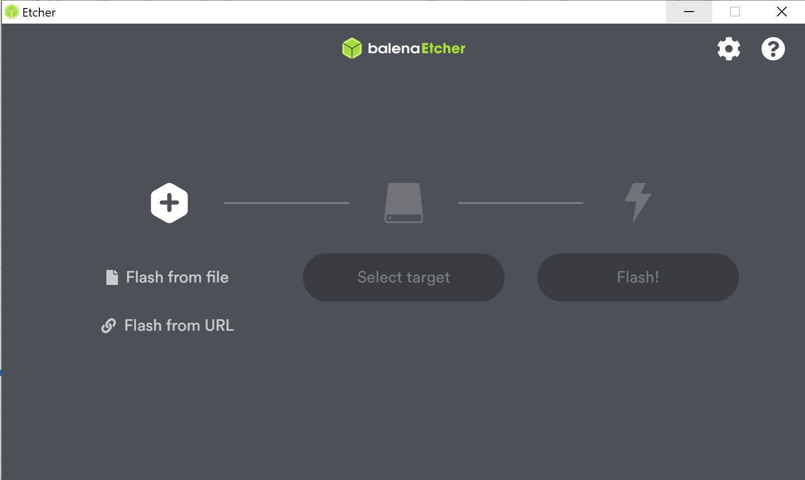
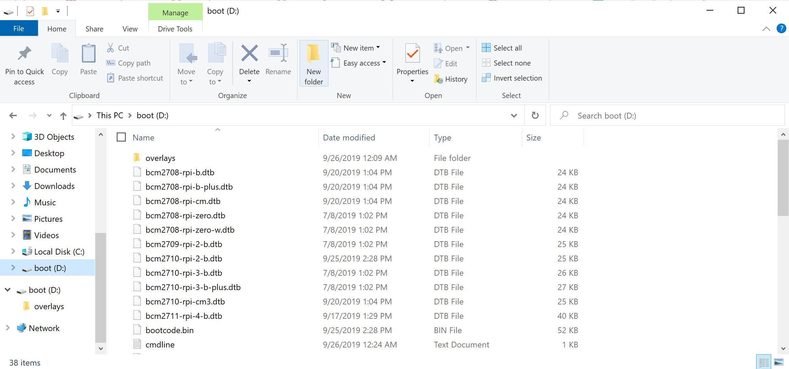
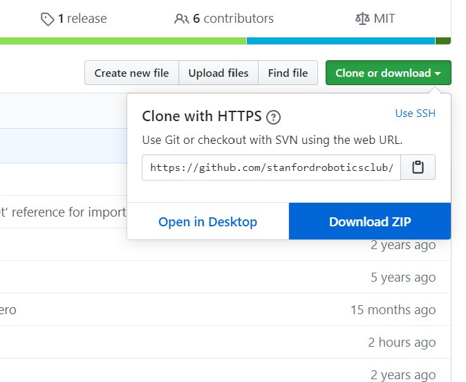
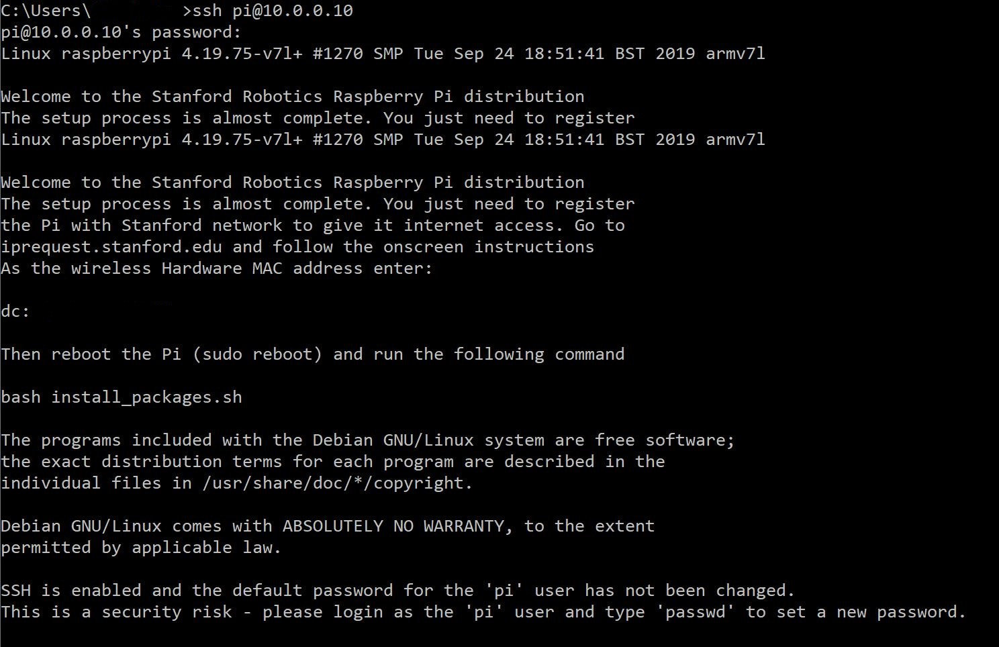
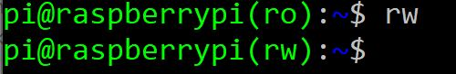
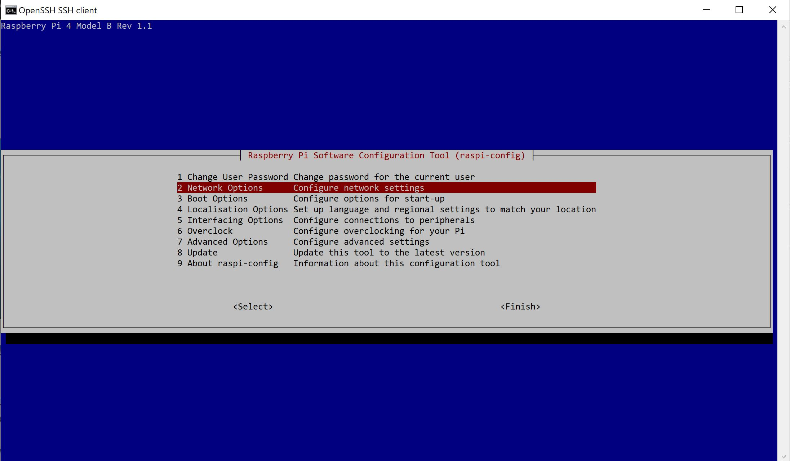
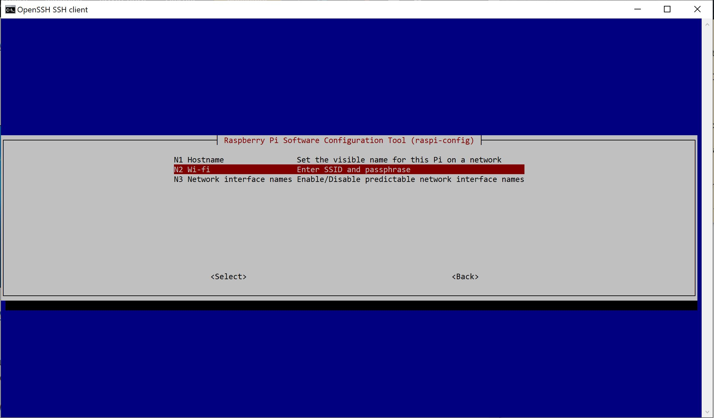
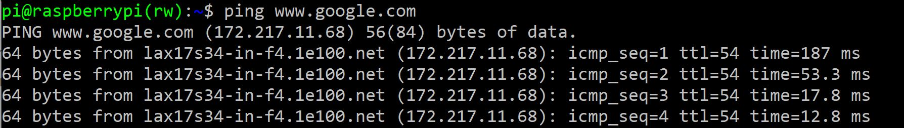

=====================
软件安装
=====================

.. contents:: :depth: 4

北京石油化工学院的用户（请你们看过来，看过来~）
------------------------------
北京石油化工学院的用户可跳过软件安装步骤，直接使用我们已经烧录的SD卡，建议使用我们所准备的显示屏，并插好键盘和电源开始下一步的调试工作。(*^_^*)
* 用户名：pi
* 密  码：raspberry
(注意没有*字符提示，请尽量一次输入正确)连入后，如下图：

有意折腾的用户，可参考以下完整步骤，所有软件及安装包均已提供。温馨提示：建议不要在特殊网的环境下进行软件安装，如校园网。尽量使用一般家用网络或商用网，并配好路由器。

设置您的Raspberry Pi
------------------------------

*  树莓派4
*	 SD卡（建议32GB）
*	   Raspberry Pi 4电源（USB-C，5V，> = 3A）
*  	    网线

准备Pi的SD卡
^^^^^^^^^^^^^^^^^^^^^^^^^^^^^^^^^

在台式机/笔记本电脑上:

1. 将SD卡插入台式机/笔记本电脑。 
###############################################

2. 下载此版本的Raspbian
#################################################################

使用 `此版本 <https://slack-files.com/T0RAWRCGY-FQG7WTSBH-eb9549ed22>`_ 以使每个人都拥有相同的版本，解压文件。

3. 使用 `etcher <https://www.balena.io/etcher/>`_ 烧录。
##########################################################################################

* •	如果您使用推荐的balenaEtcher，则这是启动菜单。选择2019-09-26-raspbian-buster-lite.img（zip内的文件）和SD卡。

*  SD卡的图像正在闪烁

*   完成!

4. 打开SD卡文件系统。
###################################################################

有时您的计算机需要一些时间才能读取SD卡并显示启动文件夹。如果问题仍然存在，请尝试重新插拔SD卡。

5. 载最新版本的 `RPI-Setup repository <https://github.com/stanfordroboticsclub/RPI-Setup>`_. 
#####################################################################################################################

* 	解压所有文件。

	
6. 将下载的代码全部移动到SD卡中。 
#####################################################################

*  替换所有冲突的文件，以便使最新的代码版本覆盖原始版本。现在，您可以删除zip文件和目前为空的文件夹。

.. image:: ../_static/replaceboot.jpg
    :align: center

启用基本功能
^^^^^^^^^^^^^^^^^^^^^^^^^^^^^^^^^^^^^^^^^^^^^^^^^^^^^

1. 打开Raspberry Pi。 
###################################################################################################
从计算机上拿走SD卡，然后将其放入Raspberry Pi中。同时将电源连接到Pi。（有显示屏的用户，建议直连，没有的请继续往下看）

2. 配置计算机，以通过SSH登录Raspberry PI
######################################################## 

* 推荐使用网线进行连接，请将网线连接到计算机和树莓派。
* 转到您所要使用的接口进行网络设置（以太网/ WiFi）
* 手动更改您的配置IPv4
* 将您的IP地址更改为10.0.0.X范围内的某个地址
* 更改您的子网掩码：255.255.255.0
* 将路由器空出
* 断开与机器狗网络的连接后，请记住将这些设置恢复为最初的设置，否则此时的互联网将无法正常工作
* 这里特别说明最好使用路由器设置静态IP,并保持同一网段，以便访问。

2. 使用 SSH进入pi。
######################################

此处，可以外接显示屏，查询对应的静态IP

运行 ``ssh pi@10.0.0.10`` (默认密码是 ``raspberry``)

3. 进入读写模式
####################################################################################################
在Raspberry PI中运行rw。
确认终端提示符以（rw）结尾而不是以（ro）结尾。

 
4. 联网
#########################

有两种访问Internet的方法：在Pi上使用raspi-config工具或更改SD卡上的wpa_supplicant文件，
然后再将其插入Pi。使用raspi-config工具比较简单，建议初学者使用。但是，修改wpa_supplicant
文件的好处是您可以设置正确的Internet设置，而无需通过SSH进入Pi。

a.	Raspi-config方法

通过SSH进入Pi后，运行：

::

	sudo raspi-config

这是将出现的菜单。进入网络选项，然后进入Wi-Fi并输入您的SSID（Wi-Fi名称，例如Netgear，Linksys）和密码。

b.  wpa_supplicant方法

编辑 **/etc/wpa_supplicant/wpa_supplicant.conf** 并进入 `这个链接 <https://www.raspberrypi.org/documentation/configuration/wireless/wireless-cli.md>`_ , 请参阅“添加网络的详细信息到树莓派”。 您也可以看这个 `链接 <https://linux.die.net/man/5/wpa_supplicant.conf>`_. 借助pi-init2脚本，可以打开pi并编辑文件。 位置**/boot/appliance/etc/wpa_supplicant/wpa_supplicant.conf**

5. 安装前提条件
##############################

* 运行 ``sudo ./install_packages.sh``
* 如果IP仍为10.0.0.10（上述自己查到的树莓派静态IP），系统将提示您进行更改。树莓派IP不应与您计算机的IP 10.0.0.Y冲突。
* 如果主机名仍然是树莓派，将提示您更改它。  
* 系统将要求您输入当前时间和日期。如果您想自动设置时间和日期，可以跳到下一步。
* 运行 ``sudo ./time_sync.sh`` 以自动设置时间和日期.

在Raspberry Pi上安装StanfordQuadruped软件
-------------------------------------------------------------

步骤
^^^^^^^

1. 通过SSH连接到Pi
##############################

检查它是否可以访问互联网。如果您无法通过SSH方式连接到Pi，请查看上一步中设置Pi的以太网设置的说明。

::

	ssh pi@10.0.0.Y
	
	* Here, "Y" is the IP address you chose for the Pi when running the install_packages.sh script. When prompted for the password, enter the default password "raspberry" or the one you set in the install_packages.sh script.

2. 测试互联网连接 
###################################### 

:: 

	ping www.baidu.com
	
输出结果应类似下图所示：

如果不是这样的，请执行以下操作：

:: 
	
	ifconfig
	
并检查wlan0部分，以检查您是否具有IP地址和其他调试信息。

3. 克隆仓库（在Pi上）
################################

::

	git clone https://github.com/stanfordroboticsclub/StanfordQuadruped.git

4. 安装命令（在Pi上）
#####################################

::

	cd StanfordQuadruped
	sudo bash install.sh

5. 对机器狗重新通电
#############################
拔下电池，等待约30秒钟，然后重新插入。

6. 验证一切正常
###############################

#. 如果您刚刚打开Pi的电源，请等待约30秒钟，直到绿灯停止闪烁。
#. 用SSH进入机器狗（树莓派）
    
    * 运行 ``ssh pi@10.0.0.xx (xx指的是你为机器狗选择的地址)``

#. 检查操纵杆的状态 

    * 运行 ``sudo systemctl status joystick``
    * •	如果您尚未连接PS4控制器，它应该显示类似以下内容 ::
        
        pi@pupper(rw):~/StanfordQuadruped$ sudo systemctl status joystick
        ● joystick.service - Pupper Joystick service
        Loaded: loaded (/home/pi/PupperCommand/joystick.service; enabled; vendor preset: enabled)
        Active: active (running) since Sun 2020-03-01 06:57:20 GMT; 1s ago
        Main PID: 5692 (python3)
            Tasks: 3 (limit: 4035)
        Memory: 7.1M
        CGroup: /system.slice/joystick.service
                ├─5692 /usr/bin/python3 /home/pi/PupperCommand/joystick.py
                └─5708 hcitool scan --flush

        Mar 01 06:57:20 pupper systemd[1]: Started Pupper Joystick service.
        Mar 01 06:57:21 pupper python3[5692]: [info][controller 1] Created devices /dev/input/js0 (joystick) /dev/input/event0 (evdev)
        Mar 01 06:57:21 pupper python3[5692]: [info][bluetooth] Scanning for devices

#. 通过设置配对模式将PS4控制器连接到Pi
    
    * 若要使其处于配对模式，请同时按住share按钮和圆形Playstation按钮，直到开始快速进行交替双闪
    * 如果开始缓慢闪烁一次，请按住Playstation按钮直到停止闪烁，然后重试。

#. 连接控制器后，再次检查状态

    * 运行 ``sudo systemctl status joystick``
    * 现在看起来应该像这样：::

        pi@pupper(rw):~/StanfordQuadruped$ sudo systemctl status joystick
        ● joystick.service - Pupper Joystick service
        Loaded: loaded (/home/pi/PupperCommand/joystick.service; enabled; vendor preset: enabled)
        Active: active (running) since Sun 2020-03-01 06:57:20 GMT; 55s ago
        Main PID: 5692 (python3)
            Tasks: 2 (limit: 4035)
        Memory: 7.3M
        CGroup: /system.slice/joystick.service
                └─5692 /usr/bin/python3 /home/pi/PupperCommand/joystick.py

        Mar 01 06:57:20 pupper systemd[1]: Started Pupper Joystick service.
        Mar 01 06:57:21 pupper python3[5692]: [info][controller 1] Created devices /dev/input/js0 (joystick) /dev/input/event0 (evdev)
        Mar 01 06:57:21 pupper python3[5692]: [info][bluetooth] Scanning for devices
        Mar 01 06:58:12 pupper python3[5692]: [info][bluetooth] Found device A0:AB:51:33:B5:A0
        Mar 01 06:58:13 pupper python3[5692]: [info][controller 1] Connected to Bluetooth Controller (A0:AB:51:33:B5:A0)
        Mar 01 06:58:14 pupper python3[5692]: running
        Mar 01 06:58:14 pupper python3[5692]: [info][controller 1] Battery: 50%
    * •	如果一两分钟后pi找不到操纵杆，则pi的蓝牙可能从未打开过。运行 ``sudo hciconfig hci0 up`` 以打开蓝牙。然后重新启动pi。

#. 检查机器狗的服务状态

    * 运行 ``sudo systemctl status robot``
    * 输出内容会根据您运行的各种程序的顺序而有所不同，但是只需检查它是否没有红色文字说明，没有则一切正常。
    * 如果有错误，通常可以运行这个解决问题： ``sudo systemctl restart robot``

7. 完成!
#########

开始校准吧！
