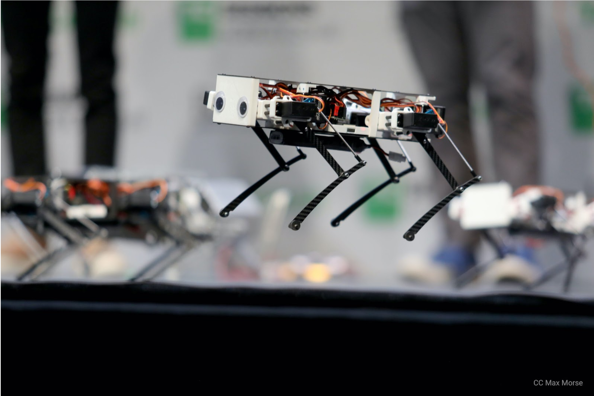

欢迎来到 Pupper 机器狗说明文档中文版!
##################################

关于 本文档
*************

本文档旨在方便国内的Pupper机器狗用户，进行组装、软件安装、调试等工作。主要针对北京石油化工学院的用户进行优化。

友情连接：
*************
* 全部文件代码及工具下载（天翼云）：https://cloud.189.cn/t/fauqm2Inqyau（访问码：i6v1）
* 国内的供应商：http://www.mangdang.net/page5
* 英文版说明（针对斯坦福）：https://pupper.readthedocs.io/en/latest/index.html

物料单：（国外不好邮还贵，建议找国内的）
*************
* 部件：https://www.amazon.com/hz/wishlist/ls/7TRIHZVMOJ7K?ref_=wl_share
* 工具：https://www.amazon.com/hz/wishlist/ls/35DHYO67BOM8N?ref_=wl_share

感谢各位老师和同学的支持和意见。如果您有什么想法或是发现文档有某些问题：
请发邮件至yangyunhao828@outlook.com，我会及时修改！

.. toctree::
    :maxdepth: 1
    :caption: 安装引导：

    guide/组装
    guide/软件安装 
    guide/校准
    guide/机器狗的操作

